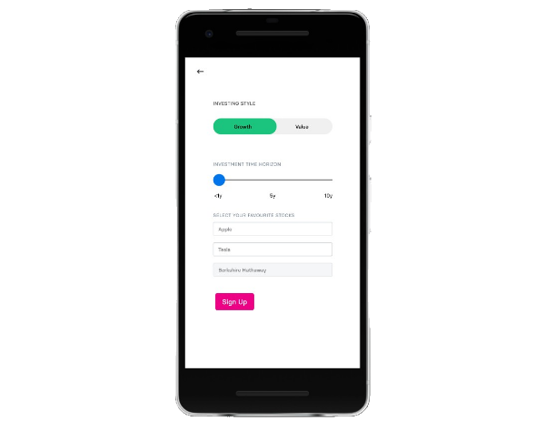

# DD - Due Diligence

## Concept

 DD - Due Diligence is a mobile application that enables users to learn about stocks and connecting with likeminded investors.

**How Does it work?**


## UI/UX 
 
- Sign up with your username, password and email address

- Log in using your username and password 

- Give DD your preference
DD will match you with users with similar interests 

- Connect 
DD will suggest up to 3 users you can chat with. If you wish to connect with them you can add them to your frinds list!
- Chat
- Snap Stock! 


## Backend 

### server.py


### Database and Schema

We used MongoDB Free Tier (512MB) by following the instruction [here](https://docs.atlas.mongodb.com/tutorial/deploy-free-tier-cluster/), and for this mobile application we made use of two collections: 

- User: identity records of the users who are using Due Diligence
- Histories: containing search history of the user 

Note to create the collection simply use the following command:

```
db.createCollection("<name collection>")

```


A user will have a record of the type:


```
{
    "_id": ObjectId("1279817381941duaiuj19837"),
    "username": "Princeton Hacker",
    "email": "user@hackprinceton.com",
    "password":"£$£&£%&$&%$*$*£%"%",
    "investmentstyle": "growth", 
    "investmenthorizon": "long term",  #or "short term
    "favourites":[
                "0" : "AAPL",
                "1" : "GOOG",
                "2" : "CVS"
    ],
    "friends":[
        "dd_id1",
        "dd_id2",
        ...
    ]
}
```

Whenever the user generates a serch, the history will be stored in `db.Histories` with a userid corresponding to the "_id" of the user in the `User` collection. The `timestamp` will be used to fetch the history search of the user with respect to the most recent. The record will be of the type:

```

{
    "_id": ObjectId("2193619745bdga08217"),
    "userid":  "_id": ObjectId("1279817381941duaiuj19837"),
    "timestamp": ISODate("2019-01-31T10:00:00.000Z"),
    "stockname": "APPL"
}

```
The search is limited to 3-5 most recent searches, i.e. described by the query: 

```
db.Histories.aggregate([{$sort: {"timestamp":-1}}, {$limit:3}])

```

where `-1` is used to describe sort descending, from most recent and limit correspond to the number of records returned.

### Vision API from Google Cloud

We have used  [Firebase ML Kit](https://firebase.google.com/docs/ml-kit/) for our Mobile application.